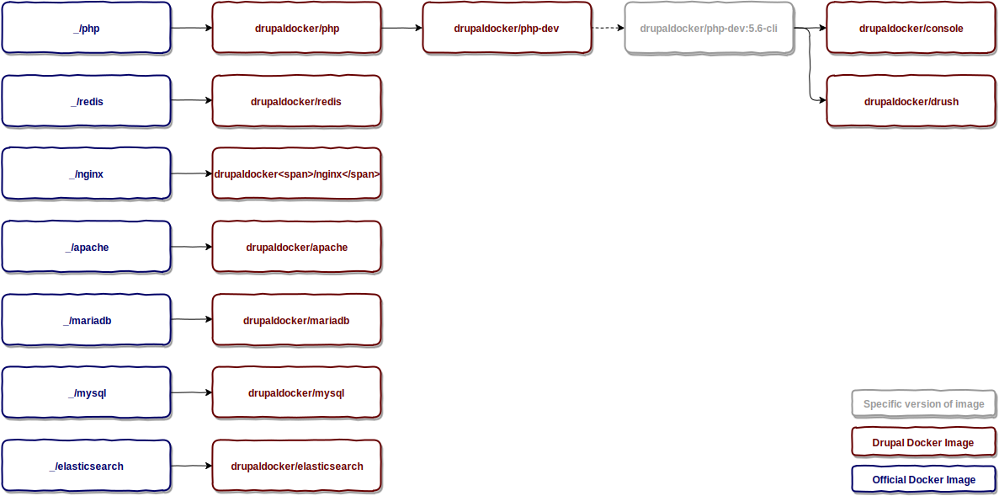

# Docker images

DDI owns and maintains several images, including:
- PHP
- MySQL, MariaDB
- Redis
- Elasticsearch

All images are hosted on [Docker Hub](https://hub.docker.com/r/drupaldocker/) so you can simply pull them using Docker client in you OS, for instance:

```
$ docker pull drupaldocker/php:7.0
```

## Diagram



## Name

Image name consists of three parts:
- vendor
- image
- tag

All images created by DDI has common `vendor` - drupaldocker. `Image` is a name of service (php, mysql) or tool (drush, console). `Tag` is usualy a version constraint inside image. Each image has default tag `latest`.

## Version

Please read and comment on [this issue](https://github.com/drupal-docker/php/issues/54)

## Dockerfiles

All images are created based on `Dockerfiles`. Dockerfile is a script, composed of various instructions, which tells Docker Engine how to build an image.

### Why Dockerfile is better than `docker push`

TBA
